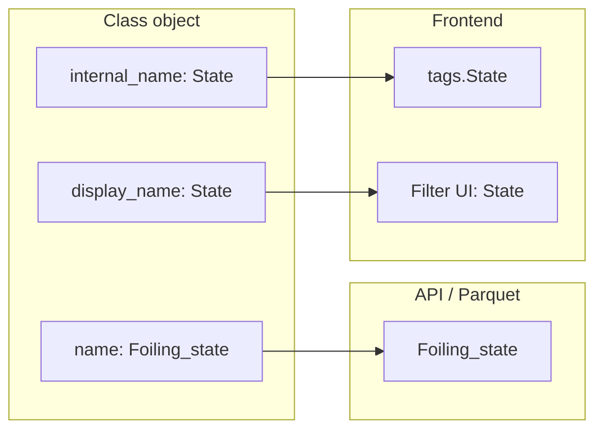

# Class objects as single source of truth for filter channels

## Current situation

- **Class objects (API/DB)** already define `filter_channels` with `name` (e.g. `Foiling_state`) and `display_name` (e.g. `"State"`), but `default_filters` still lists `"State"` and `filter_types` keys are inconsistent (sometimes missing State/Foiling_state).
- **Frontend** hardcodes:
  - `INTERNAL_TO_PARQUET_CHANNEL_NAMES` / `PARQUET_TO_INTERNAL_CHANNEL_NAMES` in [unifiedDataAPI.ts](frontend/store/unifiedDataAPI.ts)
  - `TIMESERIES_METADATA_CHANNELS_FALLBACK` in [unifiedDataStore.ts](frontend/store/unifiedDataStore.ts) and [unifiedDataAPI.ts](frontend/store/unifiedDataAPI.ts)
  - `getDefaultAC40Config()` with `name: "State"` and hardcoded `filter_types["State"]` in [unifiedFilterService.ts](frontend/services/unifiedFilterService.ts)
  - `colorCapableFields` array and many `'State'` / `'Foiling_state'` checks in store and [dataNormalization.ts](frontend/utils/dataNormalization.ts)

So the app mixes “internal” names (State) and parquet names (Foiling_state) and keeps the mapping in code instead of in the class object.

## Recommended convention

| Concept                           | Where                             | Meaning                                                                                                       |
| --------------------------------- | --------------------------------- | ------------------------------------------------------------------------------------------------------------- |
| **name**                          | `filter_channels[].name`          | Parquet/API column name (e.g. `Foiling_state`). Use for all API requests and DuckDB/parquet column selection. |
| **display_name**                  | `filter_channels[].display_name`  | UI label (e.g. `"State"`). Use in filter UIs and labels only.                                                 |
| **internal_name** (new, optional) | `filter_channels[].internal_name` | Key used in tags, filter state, and cache (e.g. `State`). If omitted, use `name`.                             |

Rules:

- **default_filters** and **filter_types** keys use **name** (parquet names) so one naming scheme drives both “what to request” and “what the backend has”.
- When present, **internal_name** defines how the frontend exposes the channel in tags/filter state (e.g. `State`) so existing filter/tag logic does not need to know parquet names.

## 1. Class object schema (API/DB)

**Goal:** One consistent naming scheme in the JSON; optional `internal_name` for tag/filter keys.

- **default_filters:** Use parquet names. Change `"State"` to `"Foiling_state"` in all four objects (filters_dataset, filters_day, filters_fleet, filters_source). This matches your existing `filter_channels[].name: "Foiling_state"`.
- **filter_types:** Use parquet names as keys. Ensure there is an entry for foiling state, e.g. `"Foiling_state": { "type": "categorical", "options": ["H0", "H1", "H2"] }` (or the existing string/numeric shape you use). Remove or avoid keys that are display names only (e.g. `"State"`) so that “available filter types” = `Object.keys(filter_types)` = parquet names.
- **filter_channels:** Keep `name: "Foiling_state"` and `display_name: "State"`. Add optional **internal_name** where the app should use a different key in tags/filter state:
  - e.g. `"internal_name": "State"` for the Foiling_state channel so tags and filter state can keep using `State` without hardcoding.

No other new fields are required. If you prefer not to add `internal_name` yet, the frontend can keep a single hardcoded map (Foiling_state → State) until you add it.

## 2. UnifiedFilterService

**Goal:** Expose parquet names for API use and optional parquet ↔ internal mapping from the class object.

- **getRequiredFilterChannels:** Keep merging `default_filters` with `(filter_channels).map(ch => ch.name)`. After the DB/API change above, this will return parquet names only (e.g. `Foiling_state`), so the file API can be called with these names as-is.
- **New: getParquetToInternalNameMap(className, context):** Return `Record<string, string>` built from the current filter config: for each `filter_channels[]` entry that has `internal_name`, set `map[ch.name] = ch.internal_name`. If a channel has no `internal_name`, do not add it (so parquet name is used as-is). This replaces the hardcoded `PARQUET_TO_INTERNAL_CHANNEL_NAMES` when config is available.
- **New (optional): getInternalToParquetNameMap(className, context):** Inverse of the above: `internal_name → name`. Useful for applying filters (filter state key `State` → column `Foiling_state` in data rows).
- **getDisplayNameForChannel(name):** Given a channel `name` (parquet name), return `display_name` from `filter_channels` for UI. Use when rendering filter labels so UI shows “State” for `Foiling_state`.
- **getDefaultAC40Config (fallback):** Align with the convention: use `name: "Foiling_state"`, `display_name: "State"`, and `internal_name: "State"` for the foiling channel; `default_filters` and `filter_types` keys use `"Foiling_state"`. This keeps fallback behavior consistent when the API is unavailable.

## 3. unifiedDataAPI

**Goal:** No hardcoded parquet/internal mapping; use class object when available.

- **Request path:** Use the channel list from `getRequiredFilterChannels` as the **channel_list** sent to the file API. After the schema change, these are parquet names, so remove `INTERNAL_TO_PARQUET_CHANNEL_NAMES` and the request-time mapping/dedup that was only needed because we were sending “State”.
- **Response path:** In `convertToDataPoints`, build the “response key → internal key” mapping from **UnifiedFilterService.getParquetToInternalNameMap(className, 'dataset')** (or the relevant context) when available; if the map is empty or the service fails, fall back to the current hardcoded `PARQUET_TO_INTERNAL_CHANNEL_NAMES` so behavior is unchanged without API config. Use this map so that e.g. `Foiling_state` in the response becomes `State` in the converted point when `internal_name` is set.
- **Async note:** `convertToDataPoints` is synchronous and currently does not take `className`. You can either (1) pass an optional `parquetToInternalMap` into `convertToDataPoints` that the caller (e.g. `getDataByChannels`) builds once per request using `getParquetToInternalNameMap`, or (2) resolve the map inside `getDataByChannels` and pass it in. Prefer (1) so conversion stays a pure function and the API layer is responsible for fetching the map.

## 4. unifiedDataStore

**Goal:** Fallback channel list is the only place that might still list “State”; keep it minimal and document that it’s parquet-agnostic fallback.

- **TIMESERIES_METADATA_CHANNELS_FALLBACK:** Keep as-is for the “no class config” path, or optionally change to parquet names (e.g. `Foiling_state`) so that when the store builds a request without config, the file API still receives the right column names. If you keep `State` here, the API layer must still map State → Foiling_state for the request when using fallback (either via the same getParquetToInternalNameMap inverse, or a small fallback map only for this case). Recommendation: keep fallback as today and let the API layer handle the single special case (State ↔ Foiling_state) when config is missing, to avoid touching many call sites.
- No new hardcoded channel lists; continue using `getRequiredFilterChannels` everywhere you already do.

## 5. Filter UI and dataFiltering

**Goal:** UI and “available filter types” derive from class object; display names and types come from config.

- **extractFilterOptions / filter UI:** Use `filter_channels` and `filter_types` keyed by **name** (parquet). For “available filter types” use `Object.keys(filter_types)` or the list of `filter_channels[].name`. When rendering labels, use `getDisplayNameForChannel(name)` (or direct lookup in `filter_channels`) so the UI shows “State” for `Foiling_state`.
- **Filter state:** Keep storing filter state under the key used in tags (e.g. `State`) when `internal_name` is set, so existing code that expects `tags.State` or `filters.State` keeps working. When applying filters to rows, if the row has `Foiling_state`, use the internal→parquet map (or the fact that filter key `State` corresponds to channel `Foiling_state`) so the correct column is filtered.

## 6. huniDBStore / dataNormalization

**Goal:** Tags and normalized metadata use the same “internal” key (State) when the class object says so.

- **Tags:** Continue normalizing so that the tag key is the internal name when present: e.g. from `row.Foiling_state` → `tags.State` using the same parquet→internal map (from config or fallback). So huniDBStore (and any code that writes tags) should use `getParquetToInternalNameMap` when building tag keys, with a small fallback for Foiling_state → State when config is missing.
- **dataNormalization:** `extractAndNormalizeMetadata` and similar can keep accepting both `State` and `Foiling_state` (and other variants) and normalizing to a single key; that key should match what the class object uses as `internal_name` (e.g. `State`). No need to hardcode every variant in the frontend if the class object defines the canonical internal name; you can reduce to “if this channel has internal_name, use it; else use name”.

## 7. Optional: extend the schema for future flexibility

- **parquet_name** (optional): If you ever need to support a channel whose `name` is the “internal” key (e.g. for non-parquet sources), you could add `parquet_name` for the file API and keep `name` as the primary key. For the current AC40 case, `name` = parquet name is enough.
- **description** and **type** in `filter_channels` are already useful for UI and validation; keep using them from the class object instead of duplicating in code.

## Implementation order

1. **API/DB:** Update the four filter objects: `default_filters` use `"Foiling_state"`; add `filter_types["Foiling_state"]`; add `internal_name: "State"` to the Foiling_state entry in `filter_channels`.
2. **UnifiedFilterService:** Add `getParquetToInternalNameMap`, `getInternalToParquetNameMap`, and `getDisplayNameForChannel`; update `getDefaultAC40Config` to the new convention.
3. **unifiedDataAPI:** Use parquet names from `getRequiredFilterChannels` for the request; use `getParquetToInternalNameMap` (with hardcoded fallback) in the response path; remove hardcoded INTERNAL_TO_PARQUET / PARQUET_TO_INTERNAL.
4. **unifiedDataStore:** Leave fallback list as-is (or switch to parquet names and document); ensure no new hardcoded channel names.
5. **Filter UI / dataFiltering:** Use filter_types and filter_channels by `name`; use display_name for labels.
6. **huniDBStore / dataNormalization:** Use parquet→internal map when building tags; keep normalizing to the same internal key (State) when defined by config.

## Result

- **Single source of truth:** Channel names, display labels, and parquet↔internal mapping come from the API class objects. Adding or renaming a channel (e.g. another parquet column with a different internal name) is done by editing the JSON, not the frontend.
- **Less hardcoding:** No INTERNAL_TO_PARQUET/PARQUET_TO_INTERNAL in the API layer once config is used; fallback remains only for the “no config” case. Color-capable and metadata channel lists can later be driven by tags (e.g. “all filter_channels” or a `used_in_ui` flag) if you want to remove those arrays too.
- **Backward compatibility:** Tags and filter state keep using `State` when `internal_name` is set; existing UIs and filters continue to work while the backend and request path move to parquet names.

